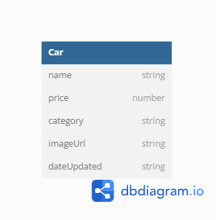

# Challenge 04

Pada challenge kali ini kita membuat dashboard admin untuk pengelolaan rental mobil

## Database Diagram



## Menjalankan secara lokal

Clone the project

```bash
  git clone https://github.com/Fadhlan54/challenge-04
```

Buka direktori project

```bash
  cd challenge-04
```

Install dependencies

```bash
  npm install
```

Jalankan server

```bash
  npm run start
```

## Dokumentasi API

### Daftar Endpoints:

1. **GET /dashboard/**

   - Deskripsi: Menampilkan halaman dashboard.
   - Contoh Request:
     ```
     GET /dashboard/
     ```
   - Controller: `adminController.getAllCars`

2. **GET /dashboard/create**

   - Deskripsi: Menampilkan halaman pembuatan mobil baru.
   - Contoh Request:
     ```
     GET /dashboard/create
     ```
   - Controller: `adminController.createPage`

3. **GET /dashboard/edit/:id**

   - Deskripsi: Menampilkan halaman pengeditan mobil dengan ID tertentu.
   - Parameter:
     - `id` (String) - ID mobil yang akan diedit.
   - Contoh Request:
     ```
     GET /dashboard/edit/651ef3f0f50cab5ad1e0b772
     ```
   - Controller: `adminController.editPage`

4. **GET /dashboard/action/delete/:id**

   - Deskripsi: Menghapus mobil dengan ID tertentu.
   - Parameter:
     - `id` (String) - ID mobil yang akan dihapus.
   - Contoh request:
     ```
     GET /dashboard/action/delete/651ef3f0f50cab5ad1e0b772
     ```
   - Controller: `adminController.removeCar`

5. **POST /api/action**

   - Deskripsi: Membuat mobil baru.
   - Form Data:
     - `name` (String) - Nama merk mobil yang akan diunggah. (required)
     - `price` (number) - Harga rental mobil per harinya. (required)
     - `category` (String) - Kategori mobil berdasarkan ukuran [small, medium, large]. (required)
     - `image` (File) - Gambar mobil yang akan diunggah. (required)
   - Contoh Request:
     ```
     POST /dashboard/action/create
     Content-Type: multipart/form-data
     Body: (Form Data)
       - name: Avanza
       - price: 30000
       - category: medium
       - image: (file) avanza.jpg
     ```
   - Controller: `adminController.upload.single("image")` (Middleware untuk mengunggah gambar), `adminController.createCar`

6. **POST /dashboard/action/edit/:id**
   - Deskripsi: Mengedit mobil dengan ID tertentu.
   - Parameter:
     - `id` (String) - ID mobil yang akan diedit.
   - Form Data:
     - `name` (String) - Nama merk mobil yang akan diunggah.
     - `price` (number) - Harga rental mobil per harinya.
     - `category` (String) - Kategori mobil berdasarkan ukuran [small, medium, large]
     - `image` (File) - Gambar mobil yang akan diunggah (opsional).
   - Contoh request:
     ```
     POST /dashboard/action/edit/651ef3f0f50cab5ad1e0b772
     Content-Type: multipart/form-data
     Body: (Form Data)
       - name: Avanza
       - price: 30000
       - category: medium
       - image: (file) avanza.jpg
     ```
   - Controller: `adminController.upload.single("image")` (Middleware untuk mengunggah gambar), `adminController.editCar`

### Keterangan:

- API ini digunakan untuk mengelola data mobil, termasuk menampilkan semua mobil, membuat mobil baru, mengedit mobil yang sudah ada, dan menghapus mobil.

- Untuk operasi pengeditan dan pembuatan mobil baru, Anda perlu mengirimkan gambar mobil dalam format file menggunakan form data dengan kunci "image".

- Untuk operasi pengeditan, data mobil yang akan diedit harus disertakan dalam request body HTTP.

- Setiap endpoint terhubung ke metode controller yang sesuai untuk mengelola HTTP request yang diterima.

- Middleware `adminController.upload.single("image")` digunakan untuk mengunggah gambar mobil. Gambar tersebut akan tersedia dalam controller setelah middleware ini menyelesaikan proses pengunggahan.
